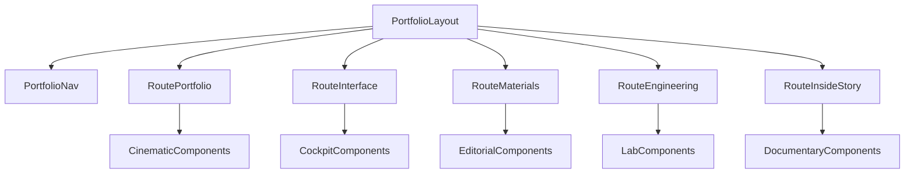

# Multi-Route Portfolio Patterns

## Goal

Create a production-grade portfolio route cluster where each route has a unique design pattern, original styling, and working components, while keeping a unified Ferrari-like premium tone.

## Route Pattern Strategy

- `/portfolio`: cinematic narrative pattern (full-bleed media, sparse typography, dramatic cadence).
- `/portfolio/interface`: cockpit pattern (dense controls, modular technical cards, interactive toggles/dials).
- `/portfolio/materials`: editorial craft pattern (asymmetric composition, material swatch storytelling, tactile details).
- `/portfolio/engineering`: performance-lab pattern (spec blocks, metric strips, chart/gauge demos).
- `/portfolio/inside-story`: documentary pattern (video-led chapter timeline and behind-the-scenes narrative).

## Shared Visual DNA (constant across routes)

- Dark, cinematic, refined industrial-luxury tone.
- High-contrast charcoal/black base with controlled metallic and yellow accents.
- Distinctive type pairing: display serif for section headlines + precise sans for technical captions.
- Motion language: restrained fades/slides and media crossfades; no scroll hijacking.

## Files To Add

- [/Users/workgyver/Developer/v7/apps/web/src/app/portfolio/page.tsx](/Users/workgyver/Developer/v7/apps/web/src/app/portfolio/page.tsx) — server page composing all sections.
- [/Users/workgyver/Developer/v7/apps/web/src/app/portfolio/layout.tsx](/Users/workgyver/Developer/v7/apps/web/src/app/portfolio/layout.tsx) — route shell and spacing.
- [/Users/workgyver/Developer/v7/apps/web/src/app/portfolio/interface/page.tsx](/Users/workgyver/Developer/v7/apps/web/src/app/portfolio/interface/page.tsx) — cockpit pattern route.
- [/Users/workgyver/Developer/v7/apps/web/src/app/portfolio/materials/page.tsx](/Users/workgyver/Developer/v7/apps/web/src/app/portfolio/materials/page.tsx) — editorial materials route.
- [/Users/workgyver/Developer/v7/apps/web/src/app/portfolio/engineering/page.tsx](/Users/workgyver/Developer/v7/apps/web/src/app/portfolio/engineering/page.tsx) — performance data route.
- [/Users/workgyver/Developer/v7/apps/web/src/app/portfolio/inside-story/page.tsx](/Users/workgyver/Developer/v7/apps/web/src/app/portfolio/inside-story/page.tsx) — documentary route.
- [/Users/workgyver/Developer/v7/apps/web/src/app/portfolio/portfolio-content.ts](/Users/workgyver/Developer/v7/apps/web/src/app/portfolio/portfolio-content.ts) — structured copy/media/demo config.
- [/Users/workgyver/Developer/v7/apps/web/src/app/portfolio/portfolio-routes.ts](/Users/workgyver/Developer/v7/apps/web/src/app/portfolio/portfolio-routes.ts) — typed route/pattern registry.
- [/Users/workgyver/Developer/v7/apps/web/src/app/portfolio/_components/portfolio-header.tsx](/Users/workgyver/Developer/v7/apps/web/src/app/portfolio/_components/portfolio-header.tsx) — shared sticky header + CTA.
- [/Users/workgyver/Developer/v7/apps/web/src/app/portfolio/_components/portfolio-nav.tsx](/Users/workgyver/Developer/v7/apps/web/src/app/portfolio/_components/portfolio-nav.tsx) — route switcher.
- [/Users/workgyver/Developer/v7/apps/web/src/app/portfolio/_components/story-section.tsx](/Users/workgyver/Developer/v7/apps/web/src/app/portfolio/_components/story-section.tsx) — reusable cinematic section wrapper.
- [/Users/workgyver/Developer/v7/apps/web/src/app/portfolio/_components/media-stage.tsx](/Users/workgyver/Developer/v7/apps/web/src/app/portfolio/_components/media-stage.tsx) — full-bleed media stage.
- [/Users/workgyver/Developer/v7/apps/web/src/app/portfolio/_components/demo-mode.tsx](/Users/workgyver/Developer/v7/apps/web/src/app/portfolio/_components/demo-mode.tsx) — drive-mode interactive demo.
- [/Users/workgyver/Developer/v7/apps/web/src/app/portfolio/_components/demo-torque.tsx](/Users/workgyver/Developer/v7/apps/web/src/app/portfolio/_components/demo-torque.tsx) — torque interaction demo.
- [/Users/workgyver/Developer/v7/apps/web/src/app/portfolio/_components/demo-panel.tsx](/Users/workgyver/Developer/v7/apps/web/src/app/portfolio/_components/demo-panel.tsx) — cockpit control tabs demo.
- [/Users/workgyver/Developer/v7/apps/web/src/app/portfolio/_components/demo-binnacle.tsx](/Users/workgyver/Developer/v7/apps/web/src/app/portfolio/_components/demo-binnacle.tsx) — dial cluster demo.
- [/Users/workgyver/Developer/v7/apps/web/src/app/portfolio/_components/material-swatch.tsx](/Users/workgyver/Developer/v7/apps/web/src/app/portfolio/_components/material-swatch.tsx) — materials route interactive swatches.
- [/Users/workgyver/Developer/v7/apps/web/src/app/portfolio/_components/perf-metrics.tsx](/Users/workgyver/Developer/v7/apps/web/src/app/portfolio/_components/perf-metrics.tsx) — engineering route metric components.
- [/Users/workgyver/Developer/v7/apps/web/src/app/portfolio/_components/story-timeline.tsx](/Users/workgyver/Developer/v7/apps/web/src/app/portfolio/_components/story-timeline.tsx) — inside-story timeline component.
- [/Users/workgyver/Developer/v7/apps/web/src/app/portfolio/_components/cta-band.tsx](/Users/workgyver/Developer/v7/apps/web/src/app/portfolio/_components/cta-band.tsx) — route-specific CTA strip.

## Files To Update

- [/Users/workgyver/Developer/v7/apps/web/src/styles/globals.css](/Users/workgyver/Developer/v7/apps/web/src/styles/globals.css) — add route-scoped portfolio tokens and pattern-specific CSS hooks.

## Route Acceptance Criteria

- Each route must include at least one real interactive demo component.
- Any two routes must differ in at least three dimensions: layout composition, typography scale rhythm, interaction primitive, and background treatment.
- Shared shell/header stays constant, but body composition and visual pattern must be route-specific.
- All routes stay swappable through one typed content/config model with placeholder assets.

## Demo Component Contract

Use a typed content model so every section is data-driven and swappable:

```ts
export type Story = {
  id: string;
  title: string;
  body: string;
  media: { kind: "image" | "video"; src: string; alt: string };
  pattern: "cinematic" | "cockpit" | "editorial" | "lab" | "documentary";
  demo?: "mode" | "torque" | "panel" | "binnacle" | "swatch" | "metrics" | "timeline";
};
```

## Motion, A11y, and Performance Requirements

- `prefers-reduced-motion` support for every animated element.
- 44px minimum touch targets on all interactive controls.
- No `transition: all`; animate only `transform`/`opacity`.
- Keep media placeholders dimensioned to avoid layout shift.
- Include keyboard focus states and aria labels for all interactive demo controls.

## Build Flow



## Verification

- Run typecheck for `apps/web`.
- Run lint diagnostics on all changed `portfolio` routes/components.
- Validate reduced-motion and keyboard behavior on every portfolio route.
- Compare routes side-by-side to confirm clear design-pattern differentiation.
